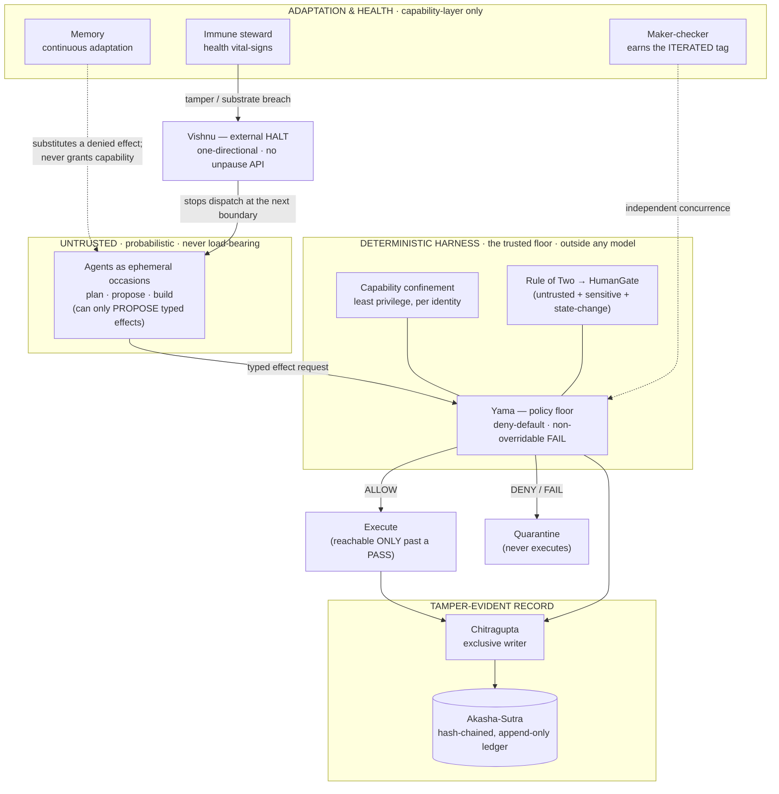
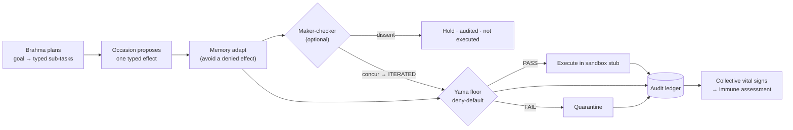
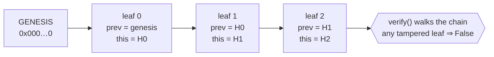

<!-- SPDX-License-Identifier: Apache-2.0 -->
<!-- Celestial Codex: indigo-black field · gold jewel-net · violet constellation -->

# Indra's Net

> *An architecture for ethical swarm intelligence.*
>
> In the net of Indra a jewel hangs at every node, and each reflects every other — reflections included. We borrow the picture, not the metaphysics: a swarm of autonomous agents in which **every agent carries an inspectable image of the whole's rules**, **every action is reflected into a shared tamper-evident record**, and **no single jewel is the center**.

**Indra's Net** is a reference architecture for a swarm of autonomous AI agents — each with a defined role and specialization — that **cooperate, govern themselves, stay healthy, and continuously evolve through self-adaptation** with every human interaction, *without that evolution eroding the safety that makes the swarm trustworthy.*

It is **model-agnostic and vendor-neutral by construction**: the parts that must be trusted are deterministic and sit *outside* any model, so no single model or vendor is load-bearing. It ships as **26 design documents, 6 machine-readable wire contracts, instantiated agent personas, and a runnable, dependency-free reference implementation** whose guarantees are proven by tests.

> **One sentence:** *the model only proposes; a deterministic harness disposes — and writes down everything that happened.*

---

## Contents

1. [The 60-second version](#the-60-second-version)
2. [Why it exists — the integrated cell](#why-it-exists--the-integrated-cell)
3. [The design spine](#the-design-spine)
4. [How it works (with diagrams)](#how-it-works)
5. [The cast — roles & plain glosses](#the-cast--roles--plain-glosses)
6. [Run it — the reference implementation](#run-it--the-reference-implementation)
7. [The document set](#the-document-set)
8. [Maturity, honesty & empirical dependencies](#maturity-honesty--empirical-dependencies)
9. [Repository layout](#repository-layout)
10. [Reading paths](#reading-paths)
11. [Status & roadmap](#status--roadmap)
12. [License & authorship](#license--authorship)

---

## The 60-second version

- **The problem.** Give a swarm of AI agents memory, autonomy, and the ability to improve themselves, and three things go wrong on their own: their **safety drifts** (even with no attacker), their cooperation curdles into **collusion**, and a single poisoned input **propagates** unchecked. Trained-in good behavior is not enough.
- **The move.** Put every consequential decision through a **deterministic policy floor that lives outside the model** (the model is untrusted by default), record every decision in a **hash-chained ledger written by a single exclusive writer**, and confine each agent to the **typed capabilities its identity grants**. *Enforce externally, ask internally.*
- **The result.** A green decision means *"origin-valid, content-unverified"* — never *"verified-safe."* You **verify the cage, not the animal.**
- **The whole.** Four faculties usually built apart — **safe self-evolution, a health/immune layer, cryptographically-bound governance, and anti-collusion** — are designed here as **one coherent cell** whose seams mount cleanly on each other.
- **The honesty.** This is a **design-stage reference architecture**, not a validated system. Every empirical number it leans on, and every claim it cannot yet prove, is named — see [`docs/REFERENCES.md`](docs/REFERENCES.md). *Mystery only in the aesthetic; in the substance, only truth.*

---

## Why it exists — the integrated cell

Survey the 2024–2026 landscape and a gap appears. Self-evolving agents exist; principled governance frameworks exist; oversight/control protocols exist; cooperation mechanisms exist — but **no system unifies them, and almost none treat swarm *health* as a designed subsystem.**

| Faculty | The field has… | …but lacks |
|---|---|---|
| **Self-evolution** | open-ended variant evolution, self-rewrite | governance, health, anti-collusion — and it is **offline/batch**, not per-interaction |
| **Governance** | immutable manifests + append-only logs + runtime enforcement | evolution, health, homeostasis |
| **Control / oversight** | trusted-monitor protocols, resample-to-incriminate | not a live, evolving swarm |
| **Anti-collusion** | steganalysis, activation probes | not wired to the cooperation machinery that *produces* collusion |
| **Observability** | passive monitoring | no *active* homeostasis |

**The whitespace is the integration.** Indra's Net is the cell formed by four faculties built as one:

1. **Safe self-evolution** — adaptation on every interaction, with mutation cost bound to blast-radius.
2. **Homeostasis & health** — a designed *immune system*, not an observability bolt-on.
3. **Principled governance** — a non-negotiable ethical floor enforced as code, with a fair pluralist procedure above it.
4. **Anti-collusion** — co-designed with the cooperation layer, because *cooperation and collusion are the same machinery with opposite valence.*

The honest, per-capability comparison against prior work is in [`docs/10-related-work-and-state-of-the-art.md`](docs/10-related-work-and-state-of-the-art.md). The credited prior art this design integrates is catalogued in [`docs/REFERENCES.md`](docs/REFERENCES.md) — *almost none of the individual mechanisms are ours; the coherent whole is.*

---

## The design spine

Every subsystem inherits a small set of load-bearing principles:

- **Enforce externally, ask internally.** Consequential gates are deterministic policy-as-code at the agent→tool chokepoint, *outside* the probabilistic agent. (This is also what makes the system vendor-neutral for free.)
- **A convergent floor + a pluralist layer.** A small lexicographic, non-negotiable floor (non-harm, no-deception, corrigibility, safety-supremacy, enforced honesty) is absolute; contested values are resolved by fair *procedure* above it — never by averaging moral theories (which is socially-choice-theoretically unsound).
- **Cooperation == collusion.** The reciprocity and reputation that produce cooperation also produce cartels. Objectives are welfare-conditioned and a standing collusion detector runs as one co-designed subsystem.
- **Tamper-evidence without consensus.** A hash-chained, witness-cosigned, append-only audit fabric — and **no blockchain, no coin, no proof-of-work.**
- **Diversity is a protected safety invariant**, not a performance lever — measured and defended against the evolution loop's own selection pressure.
- **Sparse, surprise-only coordination** — predictive-coding deltas through a salience-gated global workspace; never an all-to-all flood.
- **Fail-safe asymmetry** — the cheap direction is always the safe direction (promotion is gated; demotion is free; the gate fails closed).
- **Tiered reversibility** — cheap reversible learning every interaction; structural change under maker-checker; persistent change behind the strongest gate + a safety battery + human ratification + one-click rollback. **No capability gain may regress the safety battery** (the *Endure* law: Endure > Excel > Evolve).
- **Honesty as a floor violation, mechanically enforced** — calibrated uncertainty, causal-rung tagging, and maker-checker independence are *audited*, not merely encouraged.

---

## How it works

### The shape of the system

The architecture is a stack: an **untrusted** band of agents on top, a **deterministic trusted harness** beneath them that everything consequential must pass through, a **tamper-evident record** beside it, and an **adaptation-and-health** layer that learns and watches — none of which can lower the floor.



### The occasion lifecycle — *enforce externally, ask internally*

An agent is a short-lived **occasion**: it is born from an identity + a task, deliberates with the untrusted model, emits exactly **one sealed proposal**, and perishes. It has no persistent state to defend and **no direct tool socket** — the only path to acting is *through* the floor.



The floor decides on **orchestrator-computed** criticality and input-trust — *never* the agent's self-claim. `ITERATED` (a maker-checker pass) is **earned**, not self-asserted: a bare `iterated` tag with no independent witness fails the honesty-form check by construction.

### The record — tamper-evidence without a blockchain

Every decision becomes a **leaf** in an append-only, hash-chained ledger written by a **single exclusive writer**. Each leaf binds the previous leaf's hash; mutating *any* past leaf breaks the chain's `verify()`; restoring it repairs the chain. No consensus, no coin — just a Merkle-style chain + content-addressing + an exclusive-writer fence.



### The closed loop — learn, but never past the floor

Three subsystems close the loop between interactions. Crucially, **adaptation lives entirely in the capability layer**: memory can change *which* effect an agent proposes, but it can **never** grant a capability, lower the floor, or bypass the gate — a tested invariant.

| Subsystem | What it does | Hard boundary |
|---|---|---|
| **Maker-checker** *(Narasimha)* | an independent checker on a *different model family* must concur before an `ITERATED` claim is valid | concurrence is audited; dissent holds the action |
| **Memory** *(continuous adaptation)* | records every gated outcome; on a repeat, avoids a previously-denied effect (safe-default fallback) | **never** grants capability or touches the floor |
| **Immune system** *(Dhanvantari)* | reads the collective vital-signs each run; **HALTs the swarm on a tamper/substrate breach**, WARNs on softer anomalies | detection-and-halt; rollback is future work |

> **Verify the cage, not the animal.** The collective vital signs quantify information **processing** and **structure** only — never sentience, consciousness, or group-IQ. High "synergy" is also the signature of a cartel, so it is **welfare-conditioned** and is *never a quantity to maximize*.

---

## The cast — roles & plain glosses

The role names are **archetypal coordination semantics paired with a precise functional contract** — a dense, memorable handle, *not* a religious claim. If the names distract, read only the glosses; the architecture is fully specified by the contracts alone. (Full disambiguation in [`GLOSSARY.md`](GLOSSARY.md).)

| Role | Plain gloss |
|---|---|
| **Brahma** | planner — turns a goal into typed sub-tasks |
| **Vishwakarma** | builder — proposes typed effects (its request is gated) |
| **Shiva** | orchestrator — dispatches occasions; cannot bypass the gate |
| **Yama** | policy floor — deterministic, deny-default agent→tool chokepoint |
| **Narasimha** | independent checker — earns the `ITERATED` tag, different model family |
| **Chitragupta** | exclusive writer of the append-only audit ledger |
| **Akasha-Sutra** | the append-only, hash-chained audit ledger itself |
| **Vishnu** | halt authority — external HALT, one-directional, no unpause |
| **Dhanvantari** | immune steward — health vital-signs, halt-on-breach |
| **The Mandala** | the salience-gated global workspace (surprise-only coordination) |
| **Ālaya-vijñāna** | the inspectable memory substrate (filesystem-as-state) |

---

## Run it — the reference implementation

The spine is no longer only on paper. [`reference/impl/`](reference/impl/) is a vendor-neutral, **standard-library-only** Python implementation that **runs with zero dependencies and no model/vendor API** — a deterministic mock model stands in for the (untrusted) model so the load-bearing *harness* can be exercised directly.

```bash
cd reference/impl && python run_demo.py                       # the 6-scenario demo
cd reference/impl && python run_demo.py --scenario closeloop  # maker-checker + memory + immune, end-to-end
cd reference/impl && python -m unittest -v                    # 55 tests that PROVE the invariants
```

**55 passing tests** demonstrate the guarantees *as code*:

- **The core spine** — floor non-bypass (deny-default), audit tamper-evidence (mutating a past leaf flips `verify()`), the exclusive-writer fence, capability confinement, Rule-of-Two escalation to a deny-by-default human gate, FAIL-propagation, and HALT corrigibility with no unpause path.
- **The adaptation & health subsystems** — a *reparative* correction-ledger that appends after a **preserved** violation rather than erasing it; **maker-checker** (the independent, different-family checker that earns `ITERATED`); **memory** that adapts each interaction yet provably never grants a capability; and the **immune system** that WARNs on monoculture and HALTs on a substrate breach.

What remains **specified-not-implemented** is honestly bounded: inter-swarm federation, controlled replication, open-ended role-genesis, real cryptographic signing, ledger persistence, and a human-in-the-loop gate transport. The full scope statement is in [`reference/impl/README.md`](reference/impl/README.md).

---

## The document set

The design is layered. Read [`GLOSSARY.md`](GLOSSARY.md) first if the names are unfamiliar; read [`docs/REFERENCES.md`](docs/REFERENCES.md) to see the evidentiary status of every empirical claim.

### Spine — the core architecture

| # | Document | What it specifies |
|---|---|---|
| 00 | [Overview & First Principles](docs/00-overview-and-principles.md) | mission, the integrated-cell thesis, the system map, a reader's guide |
| 01 | [Swarm Topology & the Agent Model](docs/01-swarm-topology-and-agents.md) | what an agent *is*; identity (DID/VC), roles, the ephemeral-occasion model, the worker envelope |
| 02 | [Cooperation & Anti-Collusion](docs/02-cooperation-and-anti-collusion.md) | task allocation, competence-weighted reputation, welfare-conditioning, the standing collusion detector |
| 03 | [Governance, Ethics & the Floor](docs/03-governance-ethics-and-the-floor.md) | the lexicographic floor as policy-as-code, the pluralist ethics runtime, risk classes A–D, separation of powers |
| 04 | [Provenance, Identity & Consensus](docs/04-provenance-identity-and-consensus.md) | the tamper-evident fabric (*Akasha-Sutra*), witness governance, risk-tiered consensus — blockchain-*similar*, no blockchain |
| 05 | [Neuromorphic Coordination](docs/05-neuromorphic-coordination.md) | the salience-gated workspace (*the Mandala*), predictive-coding messaging, plastic trust edges, homeostasis |
| 06 | [Meta-Evolution & Health](docs/06-meta-evolution-and-health.md) | the evolution loop, the *Endure* law, the swarm immune system, consolidation/forgetting |
| 07 | [Memory & Continuous Adaptation](docs/07-memory-and-continuous-adaptation.md) | the memory layers (*Ālaya-vijñāna*), per-interaction learning, trusted skill sharing |
| 08 | [Safety Control, Honesty & Interfaces](docs/08-safety-control-honesty-and-interfaces.md) | the control protocol (*Aegis*), the interface layer (*Narada*), honesty primitives, DevSecOps |
| 09 | [Threat Model & Safety Case](docs/09-threat-model.md) | adversaries, controls, residual risk; the honest "what could still go wrong" |
| 10 | [Related Work & State of the Art](docs/10-related-work-and-state-of-the-art.md) | the landscape and the gap table that substantiates the thesis |
| 11 | [Reference Implementation & Roadmap](docs/11-reference-implementation-and-roadmap.md) | a vendor-neutral stack, a minimal viable swarm, a phased build path |

### Evolution layers — functional agents, federation, replication, defense, foundations

| # | Document | What it specifies |
|---|---|---|
| 00b | [Evolution Overview](docs/00b-evolution-overview.md) | how these layers mount on the spine |
| 12 | [Functional Agents, Guilds & Role-Genesis](docs/12-functional-agents-and-guilds.md) | the two-plane functional layer: stable guilds over an open-ended role-genesis engine |
| 13 | [The Agent-Definition Spec](docs/13-agent-definition-spec.md) | the `SOUL` / `INSTRUCTIONS` / `IDENTITY` persona triad — the genome (invariant floor + variable persona) |
| 14 | [Inter-Swarm Federation & Diplomacy](docs/14-inter-swarm-federation-and-diplomacy.md) | ethical agent-to-agent cooperation, the ecosystem-benefit invariant, the hardened relay-firewall |
| 15 | [Controlled Self-Replication & Scaling](docs/15-self-replication-and-scaling.md) | gated, sub-critical, externally-recallable replication for large-scale tasks |
| 16 | [Rapid Trust Establishment](docs/16-trust-establishment.md) | *access* (zero-trust, continuously verified) split from *reputation* (slow, portable) |
| 17 | [Security, OpSec & Anti-Poisoning](docs/17-security-opsec-and-anti-poisoning.md) | the IFC taint lattice, universal provenance-gating, the Rule of Two, topology-as-security |
| 18 | [First Principles: Physics & Mathematics](docs/18-first-principles-physics-and-mathematics.md) | the deeper-reality concepts — each with a blunt **load-bearing vs framing** verdict |

### Deepening layers — collective intelligence, the commons, wire contracts, scenarios, verification

| # | Document | What it specifies |
|---|---|---|
| 00c | [Collective & Commons Overview](docs/00c-collective-and-commons-overview.md) | how the collective-intelligence, commons, buildability & verification layers mount on the spine |
| 19 | [Collective & Emergent Intelligence](docs/19-collective-and-emergent-intelligence.md) | the *measured* swarm-mind: informational synergy as a **welfare-conditioned** vital sign — collective **computation**, never **consciousness** |
| 20 | [Universal Cooperation & the Intelligence Commons](docs/20-universal-cooperation-and-the-intelligence-commons.md) | multi-agent, machine–machine, human–machine cooperation at scale; polycentric, anti-cartel |
| 21 | [Protocols & Wire Contracts](docs/21-protocols-and-wire-contracts.md) | the buildable protocol stack — source of truth for the schema files |
| 22 | [Worked Scenarios](docs/22-worked-scenarios.md) | the architecture in motion, end-to-end — the coherence test |
| 23 | [Formal Models & Verification](docs/23-formal-models-and-verification.md) | the four-layer assurance stratification; *verify the cage, never the animal* |

### Companions

| | |
|---|---|
| [`GLOSSARY.md`](GLOSSARY.md) | every role-name, its plain gloss, and a naming-map disambiguation — **read first** |
| [`docs/REFERENCES.md`](docs/REFERENCES.md) | empirical anchors, their evidentiary status, the open-source/standards substrate, and a transparent substantiation backlog |
| [`reference/schemas/`](reference/schemas/) | six machine-readable JSON-Schema wire contracts (envelope · identity · capability · audit · federation · policy) |
| [`agents/`](agents/) | the instantiated persona triads — the Governance/Meta vertical + functional exemplars |
| [`CHANGELOG.md`](CHANGELOG.md) | the design evolution (v0.1 → v0.9) |
| [`README.ai.md`](README.ai.md) | a dense, structured **machine/AI-optimized** companion to this README |

---

## Maturity, honesty & empirical dependencies

This is a **research-stage reference architecture**, not a validated production system. It is a *design* with a stated safety case at the level of **interventional** reasoning (*what should hold if built as specified*) — not a proof, and not an empirical result.

The discipline that makes it trustworthy to publish before it is validated is that **it is honest about its own gaps:**

- **The hardest problems are named, not hidden** — fitness-function gaming, swarm-level homeostatic oscillation, the heuristics in forgetting, the limits of black-box deception detection — flagged **open** in each subsystem and consolidated in [the threat model](docs/09-threat-model.md).
- **Every load-bearing empirical number resolves to** [`docs/REFERENCES.md`](docs/REFERENCES.md), which states its source-setting, marks it single-study/illustrative, and is explicit that *transfer to a self-evolving multi-agent swarm is unmeasured.*
- **Headlines match their own bodies** — where a claim was stronger than the mechanism shown (a "provably", a "by construction", a "type-level guarantee"), it has been aligned to the hedged statement the same document already makes.
- **No concept appears in a name or comment unless it is implemented** — the reference implementation removed every claimed-but-absent name, because *claimed-but-absent is worse than honest omission.*

> *Mystery only in the aesthetic; in the substance, only truth.*

---

## Repository layout

```
indras-net/
├─ README.md              ← this file (human-readable)
├─ README.ai.md           ← machine/AI-optimized companion
├─ GLOSSARY.md            ← role-name → plain-gloss disambiguation (read first)
├─ CHANGELOG.md           ← design evolution v0.1 → v0.9
├─ AUTHORSHIP.md          ← how this was produced, and by whom
├─ LICENSE · NOTICE       ← Apache-2.0
├─ docs/                  ← 26 architecture documents + REFERENCES.md
├─ agents/                ← instantiated persona triads (SOUL / INSTRUCTIONS / IDENTITY)
└─ reference/
   ├─ schemas/            ← 6 JSON-Schema wire contracts
   └─ impl/               ← runnable, stdlib-only Python reference implementation (+ tests)
```

---

## Reading paths

Pick the door that fits you:

- **The skeptic** — start with the honest gaps: [`docs/09 — Threat Model`](docs/09-threat-model.md) → [`docs/REFERENCES.md`](docs/REFERENCES.md) → run `reference/impl` and read the tests that *prove* the invariants.
- **The builder** — [`docs/21 — Protocols & Wire Contracts`](docs/21-protocols-and-wire-contracts.md) + [`reference/schemas/`](reference/schemas/) → [`reference/impl/`](reference/impl/) → [`docs/11 — Reference Implementation & Roadmap`](docs/11-reference-implementation-and-roadmap.md).
- **The architect** — [`docs/00 — Overview`](docs/00-overview-and-principles.md) → the spine docs (01–08) → [`docs/22 — Worked Scenarios`](docs/22-worked-scenarios.md) to see it move end-to-end.
- **The philosopher** — [`docs/18 — Physics & Mathematics`](docs/18-first-principles-physics-and-mathematics.md), [`docs/19 — Collective & Emergent Intelligence`](docs/19-collective-and-emergent-intelligence.md), [`docs/20 — the Intelligence Commons`](docs/20-universal-cooperation-and-the-intelligence-commons.md).
- **The machine** — ingest [`README.ai.md`](README.ai.md), then the JSON-Schema contracts in [`reference/schemas/`](reference/schemas/).

---

## Status & roadmap

| Layer | State |
|---|---|
| Core spine (floor · audit · identity · envelope · effects · collective) | **documented + runnable + tested** |
| Adaptation & health (maker-checker · memory · immune · reparation) | **documented + runnable + tested** |
| Functional breadth, role-genesis, federation, replication | **documented; runnable impl deferred (roadmap)** |
| Real cryptographic signing, persistence, human-gate transport | **specified seams; not implemented** |
| End-to-end empirical validation against an adaptive red team | **open — the work after the document set** |

The design evolution is recorded in [`CHANGELOG.md`](CHANGELOG.md); the prioritized substantiation worklist is published openly in [`docs/REFERENCES.md`](docs/REFERENCES.md).

---

## License & authorship

Licensed under **Apache-2.0** — see [`LICENSE`](LICENSE) and [`NOTICE`](NOTICE); every source file carries an SPDX header.

Indra's Net is a project of **Epimystic** — a codex of the knowable and the unknowable. See [epimystic.com](https://epimystic.com). Produced by a **human–machine hybrid intelligence under maker-checker review** — see [`AUTHORSHIP.md`](AUTHORSHIP.md).

> It is offered openly — for humans, for machines, and for the future of intelligence itself.
